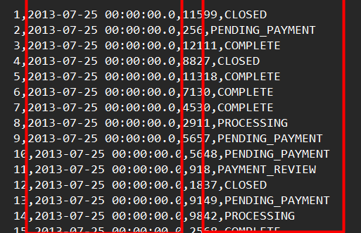

# Pipeline de ETL com Python
Em tal projeto, apresento o desenvolvimento simples de uma **Pipeline** de **ETL** em **Python**, em que extraio dados de arquivos **CSV** e metadados de um arquivo **JSON** para definir o nome das colunas de cada arquivo **CSV** importado, realizo transformações e tratamentos básicos em determinados arquivos **CSV** e carrego-os no banco de dados **PostGreSQL**.


Em tal projeto, utilizo às seguintes bibliotecas para o desenvolvimento de tal **Pipeline** em **Python**:

* **sys**: Biblioteca para definir às variávies de ambiente na aplicação **Python**
* **glob**: Biblioteca para capturar dinamicamente o nome dos arquivos dos datasets
* **os**: Biblioteca os para criar diretórios, pastas e subpastas
* **json**: Biblioteca para trabalhar com arquivos **JSON**
* **re**: Biblioteca para trabalhar com expressão regulares
* **pandas**: Biblioteca para manipulação e tratamento de dados
* **psycopg2**: Biblioteca para realizar o truncamento no banco de dados **PostGreSQL**, antes de realizar o carregamento dos arquivos **CSV**

Os arquivos **CSV** que serão extraídos e carregados para o banco de dados **PostGreSQL** são os seguintes:

* **customers**: Dados de clientes.
* **categories**: Dados de categorias de produtos.
* **departments**: Dados de departamentos.
* **order_items**: Dados de itens por pedido.
* **orders**: Dados de pedidos.
* **products**: Dados de produtos.

O arquivo **JSON** de metadados que será importado para definir o nome das colunas dos arquivos **CSV** é:

* **schemas_json**: Metadados dos arquivos CSV importados com o nome das colunas e o tipo de dado de cada coluna.

Tal projeto será separado nas seguintes fases de **(1)** Extração, **(2)** Transformação e **(3)** Carregamento.
## Extração:

Em tal fase do projeto, defini duas funções em **Python** que irão extrair os arquivos **CSV** e o arquivo **JSON** de metadados.

A primeira função foi desenvolvida para extrair os arquivos **CSV** do diretório em que tais arquivos estão armazenados, para importa-los para um **DataFrame** do **Pandas** com o uso do parâmetro **chunksize** que irá dividir cada arquivo **CSV** importado em 10 "pedaços" para armazena-los em subconjuntos e popular o banco de dados **PostGreSQL** com mais eficiência e rapidez:

```
def read_csv(file, schemas):
    file_path_list = re.split('[\\\\/]', file)
    ds_name = file_path_list[-2]
    file_name = file_path_list[-1]
    columns = get_column_names(schemas, ds_name)
    df_reader = pd.read_csv(file, names = columns, chunksize = 10000)
    return df_reader
```

A segunda função foi desenvolvida para extrair o arquivo **JSON** de metadados dos arquivos **CSV** que será utilizado para extrair o nome das colunas de cada arquivo **CSV** para importa-los no **DataFrame** do **Pandas**.

```
def get_column_names(schemas, ds_name, sorting_key = 'column_position'):
    column_details = schemas[ds_name]
    columns = sorted(column_details, key = lambda col : col[sorting_key])
    return [col['column_name'] for col in columns]
```

## Transformação:

Em tal fase, desenvolvi uma função **Python** que irá realizar tratamento e transformações básicas em determinados arquivos **CSV** de **customers** e **orders** antes de carrega-los para o banco de dados **PostGreSQL**:

```
def transform_csv(df, ds_name):
    if ds_name == 'customers':
        df['customer_full_name'] = df['customer_fname'] + ' ' + df['customer_lname']
        return print(f'Transformation of {ds_name}')
    elif ds_name == 'orders':
        df['order_status'] = df['order_status'].str.capitalize()
        df['order_status'] = df['order_status'].str.replace('_', ' ')
        df['order_date'] = pd.to_datetime(df['order_date'])
        df['order_date'] = df['order_date'].dt.date
        return print(f'Transformation of {ds_name}')
```

Tal função **Python** **(1)** adiciona a coluna de nome completo do cliente através da concatenação de **strings** da coluna de **customer_fname** e **customer_lname** do arquivo de **customers**, **(2)** coloca os status do pedido com a primeira letra em maiúsculo e **(3)** substitui o caractere **'_'** por **' '** na mesma coluna de **order_status** 

## Carregamento:

Nessa última fase do projeto de **ETL**, defini mais quatro funções **Python**, uma que realiza a conexão com banco de dados **PostGreSQL** através das variáveis de ambiente definidas, e trunca os dados das tabelas que serão populadas no banco de dados antes do carregamento de dados ser executado:
```
def truncate_tables_sql(ds_name):

    db_host = os.environ.get('DB_HOST')
    db_port = os.environ.get('DB_PORT')
    db_name = os.environ.get('DB_NAME')
    db_user = os.environ.get('DB_USER')
    db_pass = os.environ.get('DB_PASS')

    conn = psycopg2.connect(
    host = db_host,
    database = db_name,
    port = db_port,
    user = db_user,
    password = db_pass
    )

    cur = conn.cursor()

    cur.execute(f'TRUNCATE TABLE {ds_name};')
    conn.commit()
```
Uma função **Python** que irá carregar o **DataFrame** do subconjunto de dados do arquivo **CSV** para o banco de dados **PostGreSQL**:
```
def to_sql(df, db_conn_uri, ds_name):
    df.to_sql(
        ds_name,
        db_conn_uri,
        if_exists = 'append',
        index = False
        )
```
Uma função **Python** que irá iterar cada subconjunto do arquivo **CSV** importado para carrega-los e popula-los nas tabelas do banco de dados **PostGreSQL**:
```
def db_loader(src_base_dir, db_conn_uri, ds_name):
    schemas = json.load(open(f'{src_base_dir}/schemas.json'))
    files = glob.glob(f'{src_base_dir}/{ds_name}/part-*')
    if len(files) == 0:
        raise NameError(f'No files found for {ds_name}')
    
    for file in files:
        df_reader = read_csv(file, schemas)
        for idx, df in enumerate(df_reader):
            transform_csv(df, ds_name)
            print(f'Populating chunk {idx} of {ds_name}')
            to_sql(df, db_conn_uri, ds_name)
```
Por fim, a última função **Python** será usada como função principal da **Pipeline** que irá lidar com a exceção de erros de execução do aplicativo **Python** e que principalmente irá extrair os arquivos **CSV**, trata-los e transforma-los, irá truncar o banco de dados **PostGreSQL** para depois carregar os arquivos **CSV** e popula-los nas respectivas tabelas do banco de dados **PostGreSQL**.
```
def process_files(ds_names = None):

    src_base_dir = os.environ.get('SRC_BASE_DIR')
    db_host = os.environ.get('DB_HOST')
    db_port = os.environ.get('DB_PORT')
    db_name = os.environ.get('DB_NAME')
    db_user = os.environ.get('DB_USER')
    db_pass = os.environ.get('DB_PASS')

    db_conn_uri = f'postgresql://{db_user}:{db_pass}@{db_host}:{db_port}/{db_name}'

    schemas = json.load(open(f'{src_base_dir}/schemas.json'))

    if not ds_names:
        ds_names = schemas.keys()
    for ds_name in ds_names:
        try:
            print(f'Truncate Data of {ds_name}')
            truncate_tables_sql(ds_name)
            print(f'Processing {ds_name}')
            db_loader(src_base_dir, db_conn_uri, ds_name)
        except NameError as ne:
            print(ne)
            pass
        except Exception as e:
            print(e)
            pass
        finally:
            print(f'Data Processing of {ds_name} is complete')
```
## Execução da Pipeline:
Nessa última parte, irei apresentar os resultados de execução da **Pipeline** de **ETL** em **Python**, primeiramente irei colocar um exemplo dos dados dos arquivos **CSV** importados de **customers** e **orders** que foram os únicos arquivos **CSV** tratados e transformados antes do carregamento para o banco de dados **PostGreSQL**:

Dados brutos de **Customers**:


Dados brutos de **Orders**:



Depois da execução da **Pipeline** de **ETL** em **Python** foi obtido esse resultado de transformação e população de tais dados brutos de arquivos **CSV** no banco de dados **PostGreSQL**:

Dados transformados de **Customers** carregados no banco de dados **PostGreSQL**:


Dados transformados de **Orders** carregados no banco de dados **PostGreSQL**:


## Conclusão:

Por fim, tal projeto foi concluído com sucesso, uma das melhorias futuras para tal projeto seria possivelmente **(1)** usar o **Apache Airflow** para automatizar a execução de tal **Pipeline** de **ETL** em **Python** ou **(2)** conectar uma ferramenta de **BI** para entregar tais dados tratados e transformados em um **dashboard** de análise de negócios de tais dados disponibilizados.
